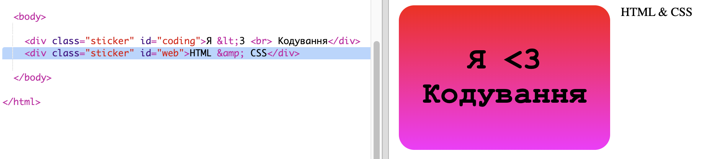
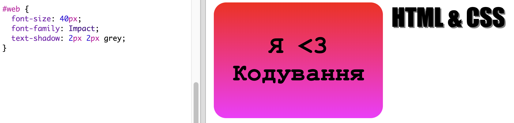
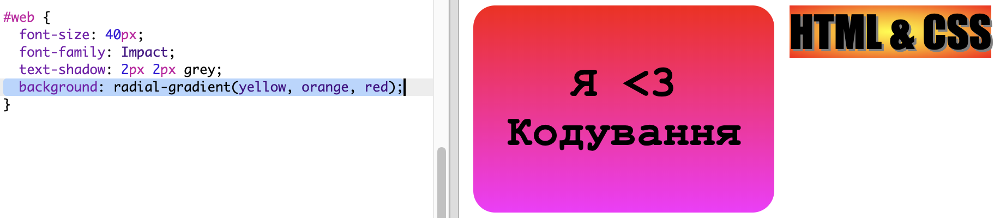
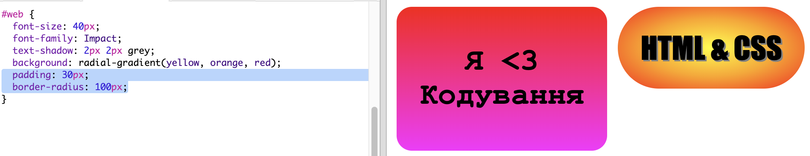

## Наклейка HTML & CSS

Градієнти також можуть змінювати колір від центру до країв, це називається радіальним градієнтом.

+ Давай створимо наклейку з текстом `HTML & CSS.` `&` — це ще один символ, який потребує кодування в HTML, його код — `&amp;`.
    
    Додай виділений код, щоб створити нову наклейку:
    
    

+ Тепер перейди до свого файлу `style.css` і додай стиль для нової наклейки:
    
    
    
    Код `text-shadow` додає тінь, яка продовжується на 2 пікселі внизу та праворуч від тексту, щоб виділити його.

+ Тепер до градієнту. Цього разу давай використовувати радіальний градієнт. Колір змінюватиметься від жовтого у центрі до оранжевого, а потім червоного кольору.
    
    
    
    Зверни увагу, що градієнти можуть включати кілька кольорів, а не тільки два.

+ Наклейка буде виглядати набагато краще з невеликими відступами та заокругленою рамкою.
    
    Додай виділений код:
    
    