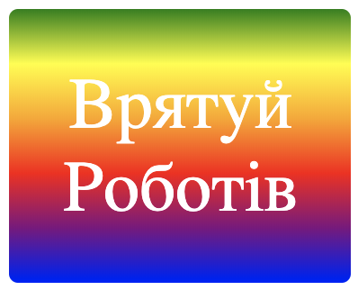

\--- challenge \---

## Завдання: створіть свою власну градієнтну наклейку

Тепер створіть власну градієнтну наклейку. Спробуйте лінійні та радіальні градієнти, використовуючи кілька кольорів HTML.

Вам потрібно буде:

+ Додайте `
` текстом наклейки ` index.html ` і надішліть наклейку ` ` клас і новий ` ідентифікатор ` .
+ Додати стиль для ідентифікатора ` ` Ви вибрали ` style.css `. Ви можете скопіювати один з стилів, який ви вже зробили, і відредагувати його. 

Тут є список всіх кольорів, які ви можете використовувати: [jumpto.cc/web-colours](http://jumpto.cc/web-colours), що включає назви кольорів, такі як `томатний`, `цегляний` та `персиковий`.

Якщо ви хочете змінити колір тексту, ви можете використовувати ` color: `.

Ось приклад того, що ви можете робити з кількома кольорами в лінійному градієнті:

\--- /challenge \---