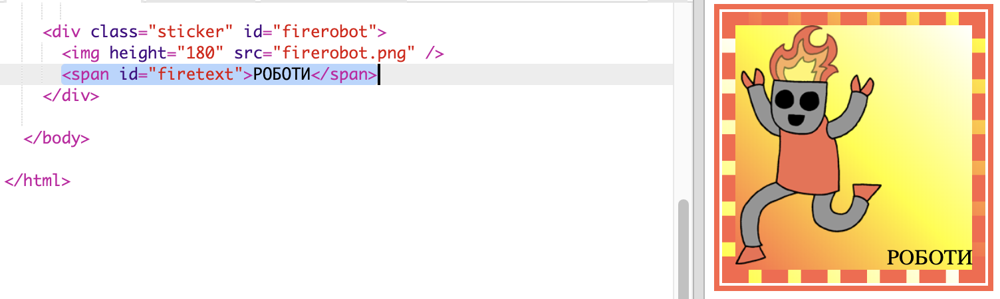
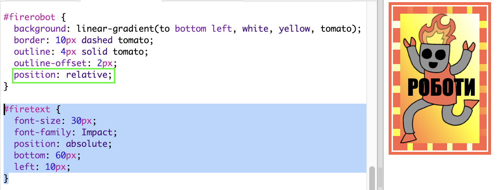
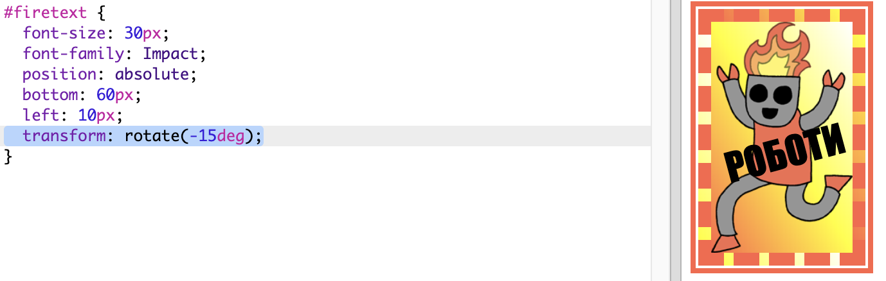

## Наклейка робот-смайлик

Ви можете створити градієнтну наклейку, використовуючи зображення. Якщо ви використовуєте зображення з прозорим фоном, то градієнт покаже його.

Ви також можете створювати градієнти для роботи в різних напрямках.

+ Додайте наклейку до ` index.html ` використовуючи ` firerobot.png ` зображення:
    
    
    
    Ви можете налаштувати ` висоту ` щоб змінити розмір зображення, ширина буде змінюватися автоматично.

+ Зазвичай лінійний градієнт проходить зверху вниз, але ви можете використовувати ` до ` змінити напрямок Наприклад: ` до початку `, ` наліво `, або ` вправо `.
    
    Для діагонального градієнта ви даєте два напрямки. У цьому прикладі використовується ` нижній лівий кут `.
    
    Додайте цей стиль до ` style.css ` щоб дати вашій новій наклейці-роботу діагональний градієнт і мальовничу межу:
    
    
    
    Зауважте, що ви можете використовувати ` контур ` щоб створити інший межу за межами звичайної. ` контур-офсет ` дає розрив між межою і контуром.

+ Давайте додамо текст до цієї наклейки.
    
    Додайте ``, що містить текст "ROBOTS", до ` index.html ` і дайте йому ідентифікатор.
    
    

+ Текст виглядатиме краще, якщо ви зробите його більшим і розмістите його правильно.
    
    Щоб розмістити текст, вам потрібно буде додати ` позицію: відносну; ` на ` #greensticker ` і ` позиція: абсолютна ` до ` #greentext `. Позиціонування більш докладно розглядається в проекті ` Build a Robot `
    
    Додайте наступний стиль до `style.css`:
    
    

+ А для остаточного кроку, повернемо текст, використовуючи ` перетворення: поворот `.
    
    
    
    Спробуйте змінити градусі обертання тексту.