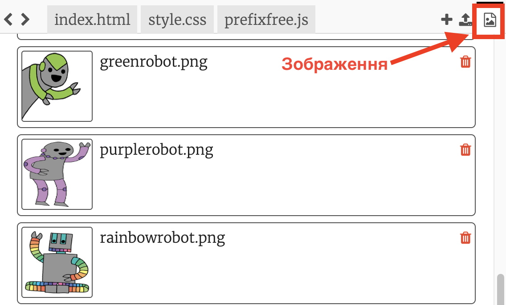
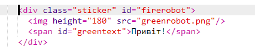
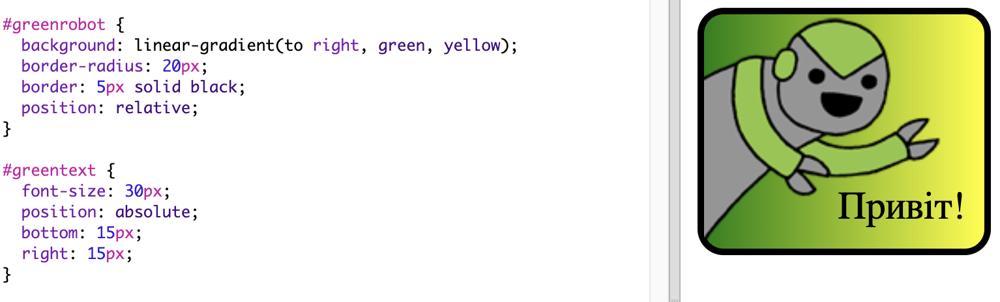

\--- challenge \---

## Завдання: зробіть більше наклейок

Тепер спробуйте створити більше наклейок, використовуючи різні градієнтні напрямки та додавайте зображення та текст, а також використовуйте межі та контури.

Порада. Вам потрібно буде додати HTML та CSS для кожної наклейки.

Ви можете скопіювати та редагувати один з ваших прикладів та внести зміни, щоб створити нову наклейку.

Ваш проект вже включає в себе набір зображень роботів. Натисніть на значок зображення, щоб побачити доступні зображення.

У цьому прикладі використовується лінійний градієнт ` праворуч ` :

\--- /challenge \---