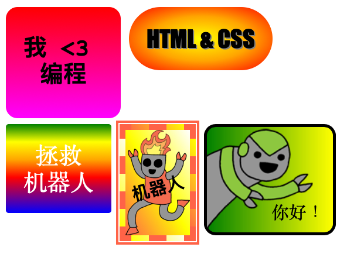

## 介绍

在此项目中，您将会创建出很多可用于装饰网页的有趣贴纸。 您将会学习使用将一种颜色变成另一种颜色的渐变梯度法，以此使您的贴纸看起来更酷。

### 俱乐部导师的附加信息

如果您需要打印这个项目，请使用[可打印版本](https://projects.raspberrypi.org/en/projects/stickers/print)。

## \--- collapse \---

## title: 俱乐部导师说明

## 介绍：

在此项目中，将向孩子们介绍CSS中的线性和径向渐变。他们将会学习到有关边界和定位的更多内容。

## 在线资源

我们建议使用[trinket](https://trinket.io/)来线上编写HTML& CSS 。此项目包含如下trinkets代码：

* [“贴纸”从此开始 -- jumpto.cc/web-stickers](http://jumpto.cc/web-stickers)

孩子们也可以使用该空白trinket [(jumpto.cc/html-blank)](http://jumpto.cc/html-blank)来编写他们的 HTML & CSS， 或者也可以使用trinket模板 [(jumpto.cc/html-template)](http://jumpto.cc/html-template)。

以下的trinket代码包含编写挑战的示范解决方案：

* ["贴纸" 完成代码 -- trinket.io/html/bb4e538e0a](https://trinket.io/html/bb4e538e0a)

## 离线资源

如果您愿意，可以[离线完成](https://www.codeclubprojects.org/en-GB/resources/webdev-working-offline/)此项目。 您可以点击该项目的“项目材料”链接来获取项目资源。 此链接包含一个“项目资源”部分，里面有孩子们离线完成该项目所需的资源。 请确保每个孩子都能获取这些资源。 该部分包含如下文件：

* intro/index.html
* template/template.html
* template/style.css
* stickers/index.html
* stickers/style.css
* stickers/script.js
* stickers/robot .png 图像

您也可以在“志愿者资源”部分找到项目挑战的完整版本，其中包含：

* stickers-finished/index.html
* stickers-finished/style.css
* stickers-finished/script.js
* stickers-finished/robot .png 图像

（上述所有资源都可以作为项目和志愿者`.zip`文件下载。）

## 学习目标

* 此项目介绍了CSS渐变的使用来创建有趣效果。学生们将能拓展他们CSS边框以及定位的知识。 

此项目涵盖了[Raspberry Pi数字制作课程](http://rpf.io/curriculum)如下的内容：

* [设计基本的2D和3D资源](https://www.raspberrypi.org/curriculum/design/creator)。

## 挑战

* “创建您自己的渐变贴纸” - 向文本添加线性和径向渐变；
* “制作更多的贴纸！” - 将渐变图像与文本结合以创建更多贴纸。

\--- /collapse \---

## \--- collapse \---

## title: 项目材料

## 项目资源

* [.zip 文件包含所有项目资源](resources/stickers-project-resources.zip)
* [在线Trinket包含所有“介绍”项目资源](http://jumpto.cc/web-intro)
* [在线Trinket包含所有“贴纸“项目资源](http://jumpto.cc/web-stickers)
* [在线Trinket模板](http://jumpto.cc/trinket-template)
* [在线空白Trinket](http://jumpto.cc/trinket-blank)
* [template/index.html](resources/template-index.html)
* [template/style.css](resources/template-style.css)
* [stickers/index.html](resources/stickers-index.html)
* [stickers/style.css](resources/stickers-style.css)
* [stickers/prefixfree.js](resources/stickers-prefixfree.js)
* [stickers/bluerobot.png](resources/stickers-bluerobot.png)
* [stickers/firerobot.png](resources/stickers-firerobot.png)
* [stickers/purplerobot.png](resources/stickers-purplerobot.png)
* [stickers/spacerobot.png](resources/stickers-spacerobot.png)
* [stickers/dogrobot.png](resources/stickers-dogrobot.png)
* [stickers/greenrobot.png](resources/stickers-greenrobot.png)
* [stickers/rainbowrobot.png](resources/stickers-rainbowrobot.png)
* [stickers/yellowrobot.png](resources/stickers-yellowrobot.png)

## 俱乐部导师资源

* [.zip 文件包含所有已完成的项目资源](resources/stickers-volunteer-resources.zip)
* [在线已完成的Trinkret项目](https://trinket.io/html/bb4e538e0a)
* [stickers-finished/index.html](resources/stickers-finished-index.html)
* [stickers-finished/style.css](resources/stickers-finished-style.css)
* [stickers-finished/prefixfree.js](resources/stickers-finished-prefixfree.js)
* [stickers-finished/bluerobot.png](resources/stickers-finished-bluerobot.png)
* [stickers-finished/firerobot.png](resources/stickers-finished-firerobot.png)
* [stickers-finished/purplerobot.png](resources/stickers-finished-purplerobot.png)
* [stickers-finished/spacerobot.png](resources/stickers-finished-spacerobot.png)
* [stickers-finished/dogrobot.png](resources/stickers-finished-dogrobot.png)
* [stickers-finished/greenrobot.png](resources/stickers-finished-greenrobot.png)
* [stickers-finished/rainbowrobot.png](resources/stickers-finished-rainbowrobot.png)
* [stickers-finished/yellowrobot.png](resources/stickers-finished-yellowrobot.png)

\--- /collapse \---