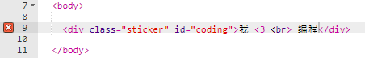
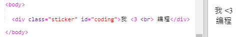
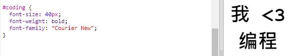
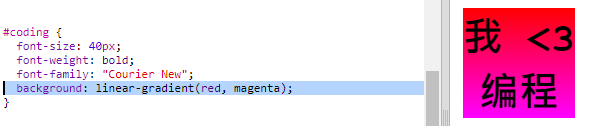
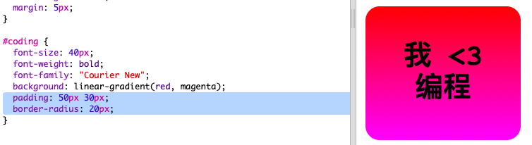

## 多彩编码贴纸

渐变是一种颜色到另一种颜色的逐渐变化。渐变可以用于创造出更多炫酷的效果。您将使用它们创造出可用于您网页的贴纸。

+ 打开该Trinket：<a href="http://jumpto.cc/web-stickers" target="_blank">jumpto.cc/web-stickers</a>。
    
    项目应该如下所示：
    
    

+ 让我们制作一张”我 <3编程“贴纸。g' sticker.
    
    使用带有`
`标签的`sticker`类和`coding` id，以便设置其样式：
    
    

+ 嗯...您发现遇到错误了吗？这是因为 ”<“ 是HTML中的特殊字符。除了 ”<“，您还需要使用特殊代码`&lt;`。
    
    更新您的代码并使用`&lt;`，这样就会停止报错。
    
    
    
    ` ` 用以换行。

+ 现在，让我们使贴纸看起来更有趣。
    
    切换至`style.css`文件。您将会看到为您提供的`.sticker`类。这将用于在网页上布置贴纸并居中内容。
    
    请记住，您已添加了id `coding` 到您的贴纸上。在`style.css`底部添加以下代码来设置文本样式：
    
    

+ 现在，您可以为贴纸背景添加渐变。线性渐变是一种颜色沿着直线变为另一种颜色。
    
    此渐变会使顶部的红色变为底部的洋红色。将渐变代码添加至您的`coding`样式中：
    
    

+ 您可以通过添加内边距和圆角来改善结果。
    
    添加高亮处代码：
    
    
    
    `padding`样式在顶部和底部分别添加了50px，在左侧和右侧分别添加了30px。