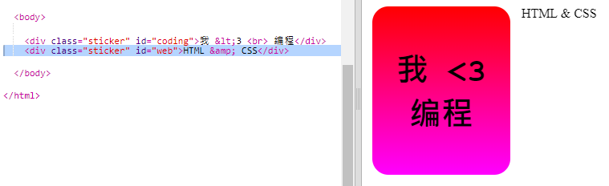
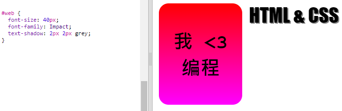
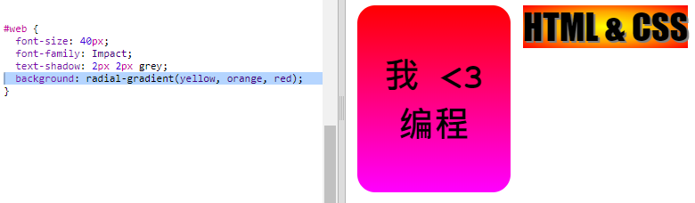
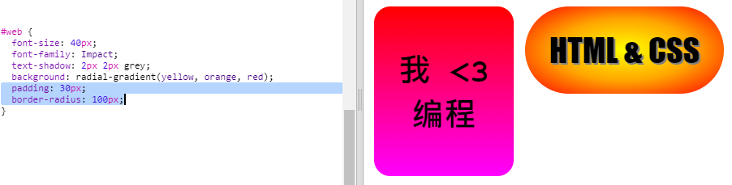

## HTML & CSS 贴纸

渐变也可以从中心向边缘改变颜色，这被称为径向渐变。

+ 让我们用`HTML & CSS`文本创建一张贴纸。`&` 是另一种需要在HTML中编码的字符，代码为`&amp;`。
    
    添加高亮处代码以创建新的贴纸：
    
    

+ 现在，切换至您的`style.css`文件并为您的新贴纸添加一个样式。
    
    
    
    `text-shadow`代码可以添加阴影，此阴影可向文本下和右侧延申2px，使其突出。

+ 现在进行渐变。这次让我们使用径向渐变。颜色将由黄色从中心变为橙色，随后变为红色。
    
    
    
    请注意，渐变可以包含多种颜色，并不只有两种。

+ 带有内边距和圆角的贴纸看起来会好很多。
    
    添加高亮处代码：
    
    