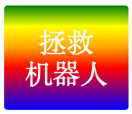

--- challenge ---

## 挑战：创建您自己的渐变贴纸

现在，制作您自己的渐变贴纸。尝试使用多种HTML颜色来进行线性和径向渐变。

您将需要:

+ 将带有`
`的贴纸添加至`index.html`，并给予其`sticker`类和新的`id`。
+ 为您在`style.css`中选择的`id`添加样式。您可以复制您已制作的其中一种贴纸样式进行编辑。 

以下列出了所有可供使用的颜色：[jumpto.cc/web-colours](http://jumpto.cc/web-colours)，其中包含了`tomato`、`firebrick`和`peachpuff`。

如果您向改变文本颜色，可以使用`color.`。

这是在线性渐变中可以使用的多种颜色的示例：

--- /challenge ---