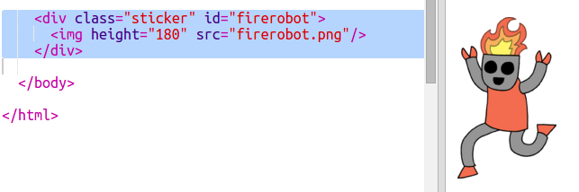

## 绚丽的机器人贴纸

您可以使用图像制作一张渐变贴纸。如果您使用一张透明背景的图像，那么，渐变就得以显示。

您也可以创建不同方向的渐变效果。

+ 使用`firerobot.png`图像向`index.html`中添加一张贴纸。
    
    
    
    您可以通过调整`height`来调整图像大小，宽度将自动进行更改。

+ 通常，线性渐变是自上而下的，但是您可以使用`to`来改变其方向。例如，`to top`、`to left`，或者`to right`。
    
    对于对交渐变，您可以指定两个方向。以下示例使用`to bottom left`。
    
    将此样式添加至`style.css`，给您的新机器人贴纸添加对角渐变和圆角。
    
    
    
    请注意，您可以使用`outline`在普通边界外添加另一个边界。 `outline-offset`用于在边界和轮廓间添加空隙。

+ 让我们在这张贴纸上添加文本。
    
    在`index.html`中添加含有文本"ROBOTS"的``标签，并给它一个id。
    
    

+ 如果您放大并对其进行定位，此文本看起来会更好。
    
    您将需要在`#greensticker`中添加`position: relative;`，在`#greentext`中添加`position: absolute`，以定位文本。 `Build a Robot`项目中，有对定位的详细介绍。
    
    将以下代码添加至`style.css`中：
    
    

+ 最后，让我们使用`transform: rotate`旋转文本。
    
    
    
    尝试改变文本的旋转角度。