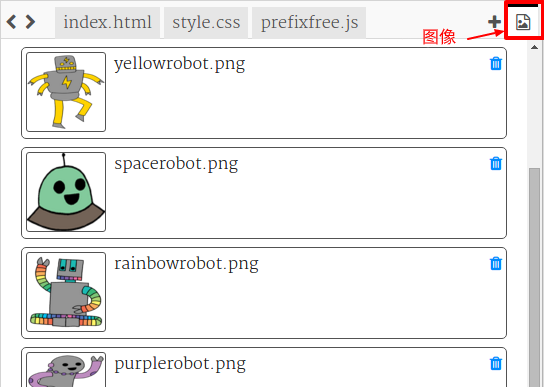
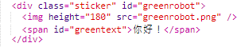
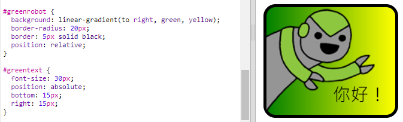

--- challenge ---

## 挑战：制作更多贴纸

现在，尝试使用不同的渐变方向、添加图像和文本，并使用边框和轮廓来制作更多贴纸。

提示：您将需要向每张贴纸添加HTML和CSS。

您可以复制和编辑其中一个示例，并更改以创建一张新的贴纸。

您的项目已经包含了一套机器人图像。点击图标，可以查看可用的图像。

此示例使用`右向`线性渐变：

--- /challenge ---

***
该项目由以下志愿者翻译：

戴晴

Sean Yong

正因为志愿者们的辛勤工作，我们才能为世界各地的人们提供用母语来学习的机会。您也可以通过志愿翻译工作来帮助我们吸引更多的人 - 更多信息，请访问[rpf.io/translate](https://rpf.io/translate)。