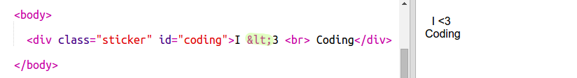

## 彩色編碼貼紙

漸變是從一種顏色到另一種顏色的逐漸變化。漸變可用於創建炫酷效果。您將使用它們來創建可在網頁上使用的貼紙。

+ 打開這個小飾品： <a href="http://jumpto.cc/web-stickers" target="_blank">jumpto.cc/web-stickers</a>。
    
    該項目應如下所示：
    
    

+ 讓我們做一個'I <3 Coding' sticker.
    
    使用 `
` 與 `貼紙` 類和 `編碼` id，以便您可以設置它：
    
    

+ 嗯你注意到你有錯誤嗎？這是因為'<'是HTML中的特殊字符。而不是'<'你需要使用特殊代碼 `&lt;`。
    
    更新您的代碼使用 `&lt;` 使錯誤消失。
    
    
    
    ` ` 給出了一個新的一行。

+ 現在讓我們讓貼紙看起來很有趣。
    
    切換到 `style.css` 文件。你會看到已經為你提供了 `.sticker` 課程。這將在頁面上佈置貼紙並使其內容居中。
    
    請記住，您已將id `編碼` 添加到貼紙中。在 `style.css` 的底部添加以下代碼來設置文本樣式：
    
    

+ 現在，您可以為貼紙的背景添加漸變。線性漸變沿直線從一種顏色變為另一種顏色。
    
    此漸變將從頂部的紅色變為底部的品紅色。將漸變代碼添加到 `編碼` 樣式：
    
    

+ 您可以通過添加填充和圓角來改善結果。
    
    添加突出顯示的代碼：
    
    
    
    `填充` 樣式在頂部和底部添加50px的填充，在左側和右側添加30px。