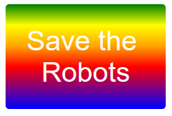

\---挑戰\---

## 挑戰：創建自己的漸變貼紙

現在製作自己的漸變貼紙。使用多種HTML顏色嘗試線性和徑向漸變。

你需要：

+ 添加帶有貼紙文字的 `
` 到 `index.html` 並給它 `貼紙` 類和一個新的 `id`。
+ 為你在 `style.css`選擇的 `id` 添加樣式。您可以復制已經製作的貼紙樣式之一併進行編輯。 

有所有可以使用的顏色名的列表： [jumpto.cc/web-colours~~V](http://jumpto.cc/web-colours)，其中包括像顏色名稱 `番茄`， `耐火磚` 和 `粉桃紅`。

如果要更改文本顏色，可以使用 `顏色：`。

以下是使用線性漸變中的多種顏色可以執行的操作的示例：

\--- /挑戰\---