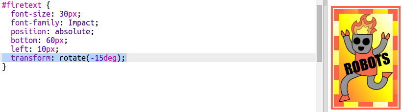

## 花式機器人貼紙

您可以使用圖像製作漸變貼紙。如果使用具有透明背景的圖像，則會顯示漸變。

您還可以創建漸變以在不同方向上運行。

+ 使用 `firerobot.png` 圖像將貼紙添加到 `index.html`：
    
    
    
    您可以調整 `高度` 以調整圖像大小，寬度將自動更改。

+ 通常，線性漸變從上到下運行，但您可以使用 `到` 來更改方向。例如： `頂部`， `至左`，或 `至權利`。
    
    對於對角線漸變，您可以給出兩個方向。此示例使用 `到左下角`。
    
    將此樣式添加到 `style.css` ，為您的新機器人貼紙添加對角線漸變和花式邊框：
    
    
    
    請注意，您可以使用 `輪廓` 在通常的邊框之外創建另一個邊框。 `outline-offset` 給出了邊框和輪廓之間的間隙。

+ 讓我們在這個貼紙上添加一些文字。
    
    添加一個包含文本“ROBOTS”的 `` 到 `index.html` 並給它一個id。
    
    

+ 如果你把它做得更大並定位它，文本看起來會更好。
    
    要定位文本，您需要添加 `位置：relative;` 到 `#greensticker` 和 `位置：絕對` 到 `#greentext`。 `Build a Robot` 項目中詳細介紹了定位。
    
    將以下代碼添加到 `style.css`：
    
    

+ 最後，我們使用 `變換旋轉文本：旋轉`。
    
    
    
    嘗試更改文本旋轉的度數。